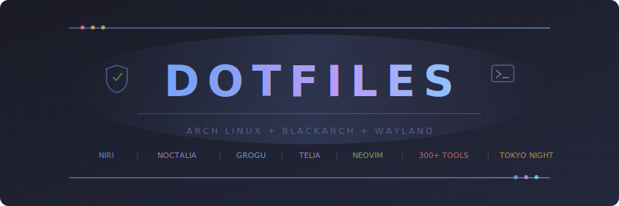
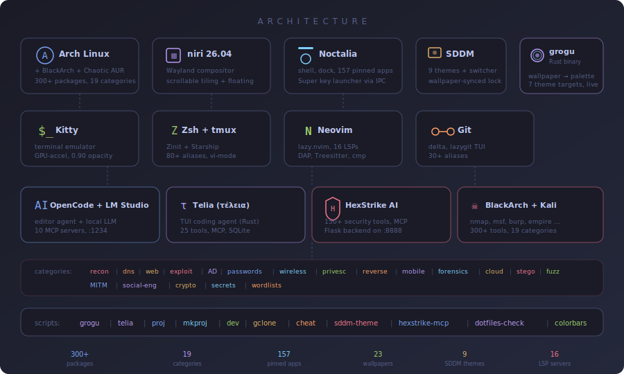
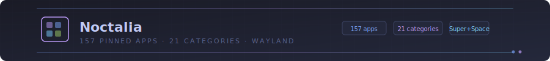
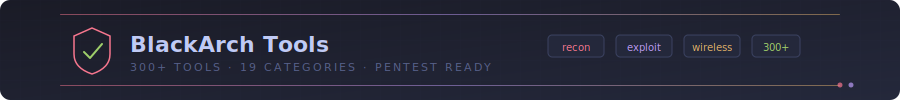
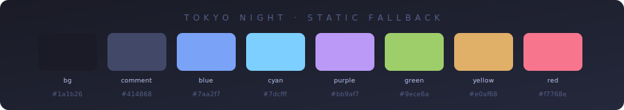

<p align="center">
  <picture>
    <source media="(prefers-color-scheme: dark)" srcset="assets/header.svg"/>
    <source media="(prefers-color-scheme: light)" srcset="assets/header-light.svg"/>
    
  </picture>
</p>

<p align="center">
  
  
  
  
  
  
  
  
  
  <a href="https://buymeacoffee.com/cardoffoolm"></a>
</p>

<p align="center">
  Personal dotfiles for a scrollable-tiling Wayland desktop built for coding and offensive security.<br/>
  <sub>One <code>curl | bash</code> on a fresh Arch install → niri, Noctalia, a wallpaper-reactive theme, two AI coding agents, and 300+ BlackArch tools.</sub>
</p>


## What's distinct

- **[grogu](https://github.com/foolish-dev/grogu)** extracts a palette from the current wallpaper and repaints Noctalia / niri / kitty / ghostty / tmux / nvim / Telia in one shot. Press `Super+W` → Noctalia's picker → every target live-reloads.
- **[Telia](https://github.com/foolish-dev/telia)** is a single-binary TUI coding agent — local Ollama or ~20 cloud endpoints, 25 built-in tools, MCP servers, SQLite session history. `Super+T` opens it in a floating panel.
- **[OpenCode](https://opencode.ai)** lives alongside Telia, configured with LM Studio + Ollama providers and 10 MCP servers (HexStrike, Context7, GitHub, filesystem, fetch, Playwright, sequential-thinking, memory, git, weather).
- **[HexStrike AI](https://github.com/0x4m4/hexstrike-ai)** MCP exposes 150+ offensive-security tools to those agents over a Flask backend on `127.0.0.1:8888`.
- **[BlackArch](https://blackarch.org) + [Chaotic AUR](https://aur.chaotic.cx)** repos pre-wired by the installer; 300+ pentest tools across 19 categories plus 147 launcher entries that open in kitty.
- **[niri](https://github.com/YaLTeR/niri) 26.04** scrollable-tiling Wayland compositor with **[Noctalia](https://github.com/noctalia-dev/noctalia-shell)** as the shell (bar, dock, panels, notifications, lock screen, app launcher).
- **Tokyo Night** is the static fallback before the first wallpaper-driven repaint.


## Quick start

```bash
curl -fsSL https://raw.githubusercontent.com/foolish-dev/niri-dotfiles/main/bootstrap.sh | bash
```

Manual:

```bash
git clone https://github.com/foolish-dev/niri-dotfiles.git ~/niri-dotfiles
cd ~/niri-dotfiles
./install.sh         # adds BlackArch + Chaotic AUR, installs ~370 packages, cargo-installs grogu + Telia
./deploy.sh          # symlinks every config tree into ~/.config/, prompts for git identity
dotfiles-check       # post-deploy health check (failed units, broken symlinks)
```

First `nvim` launch auto-installs every plugin and LSP server via lazy.nvim + Mason.

> **Git identity is automatic.** `deploy.sh` generates `~/.gitconfig.local` (gitignored, per-machine) and prompts for name + email. Override non-interactively:
>
> ```bash
> GIT_USER_NAME="Your Name" GIT_USER_EMAIL="you@example.com" ./deploy.sh
> ```
>
> **Per-machine zsh overrides.** The tracked `.zshrc` sources `~/.zshrc.local` (untracked) as its final step. Drop ROCm/CUDA env, work secrets, or private aliases there.


## Stack

<picture>
  <source media="(prefers-color-scheme: dark)" srcset="assets/stack.svg"/>
  <source media="(prefers-color-scheme: light)" srcset="assets/stack-light.svg"/>
  
</picture>

| Layer | Tool |
|---|---|
| Distro | Arch Linux + [BlackArch](https://blackarch.org) + [Chaotic AUR](https://aur.chaotic.cx) |
| Compositor | [niri](https://github.com/YaLTeR/niri) (scrollable tiling, Wayland) |
| Desktop shell | [Noctalia](https://github.com/noctalia-dev/noctalia-shell) (bar, dock, panels, launcher, lock screen) |
| Terminal | Kitty (0.90 opacity, hosts tmux) |
| Multiplexer | tmux (Ctrl-a prefix, lazygit/btop/fzf popups) |
| Shell | Zsh + Zinit + Starship + vi-mode |
| Editor | Neovim — lazy.nvim, 16 LSP servers, DAP, Treesitter |
| Theme propagation | **[grogu](https://github.com/foolish-dev/grogu)** (wallpaper → Noctalia / niri / kitty / ghostty / tmux / nvim / Telia) |
| AI coding agents | **[Telia](https://github.com/foolish-dev/telia)** (TUI) + [OpenCode](https://opencode.ai) (editor-integrated) |
| Local LLM | [LM Studio](https://lmstudio.ai) on `127.0.0.1:1234` + Ollama |
| AI security | [HexStrike AI](https://github.com/0x4m4/hexstrike-ai) MCP — 150+ tools over `127.0.0.1:8888` |
| Display manager | [SDDM](https://github.com/sddm/sddm) — 9 themes, `sddm-theme` switcher |
| File manager | Thunar (`Super+E`) |
| Audio | PipeWire + WirePlumber |
| Network | NetworkManager + iwd |
| Git | delta diffs, lazygit TUI, 30+ aliases |
| Wallpapers | 23 curated 4K wallpapers (Arch, cyberpunk, Japanese art, minimal) |
| Fallback theme | Tokyo Night |


## Screenshots

<p align="center">
  
</p>

| | |
|---|---|
|  |  |
|  |  |

> Re-capture with `./screenshots/capture.sh` (interactive: prompts for each window, runs `grim` with a configurable delay).


## grogu — wallpaper-driven theme propagation

[grogu](https://github.com/foolish-dev/grogu) is a standalone Rust binary that extracts a palette from the current wallpaper (k-means clustering in CIE Lab, accents pulled toward canonical hues) and writes it into every theming target on the desktop in one shot. Press `Super+W` → Noctalia's wallpaper picker → the `hooks.wallpaperChange` script in `~/.config/noctalia/settings.json` fires:

```bash
$HOME/.cargo/bin/grogu apply --extract="$1" --reload
```

| Target | What grogu writes | How it picks up the change |
|---|---|---|
| **Noctalia** | `colors.json` (flat m-color map) + `colorschemes/Grogu/Grogu.json`; sets `predefinedScheme = "Grogu"` | `Color.qml` file-watches `colors.json`, live-reloads every binding |
| **niri** | `~/.config/niri/grogu.kdl` (focus-ring colours) | niri live-reloads on save |
| **kitty** | `~/.config/kitty/grogu.conf` | `--reload` sends `SIGUSR1` to every running kitty |
| **ghostty** | `~/.config/ghostty/themes/grogu` | ghostty live-reloads on save |
| **tmux** | `~/.config/tmux/grogu.conf` | `--reload` runs `tmux -S <socket> source-file` on every live socket |
| **nvim** | `~/.config/nvim/colors/grogu.vim` | Activate with `:colorscheme grogu` |
| **Telia** | `prefs.theme` row in telia's SQLite | Picked up on next launch |

Three predefined themes also ship, usable without an extract:

```bash
grogu apply --theme catppuccin       # lock to a built-in
grogu apply --theme tokyo-night      # default fallback
grogu paths                          # everywhere grogu reads / writes
grogu extract /path/to/img.jpg       # preview palette without writing
```

The installer runs `cargo install --git https://github.com/foolish-dev/grogu --branch main --locked` → `~/.cargo/bin/grogu`. `.gitignore` excludes every grogu output file (`grogu.{conf,kdl,vim}` / `colors.json` / `colorschemes/`) — they're generated, not source. Tokyo Night is the static fallback before the first run.


## Telia — TUI coding agent

[Telia (τέλεια)](https://github.com/foolish-dev/telia) is a single-binary TUI coding agent — talks to local Ollama or any of ~20 cloud chat-completions endpoints (~210 named models), runs 25 built-in tools (read/write/edit, bash, list/glob/grep, head/tail/tree/stat/diff, apply_patch, lint/format/typecheck), hosts MCP servers, and persists sessions to SQLite.

```bash
telia                            # local Ollama (default: hf.co/FoolDev/Thanatos-27B)
telia --model claude-opus-4-7    # cloud (uses $ANTHROPIC_API_KEY, prompts otherwise)
telia --resume                   # pick up the last session (alias: -r, --continue)
telia --plan                     # read-only tools, no mutations
telia --auto                     # no confirmation prompts
```

`Super+T` launches Telia in a floating kitty (`--class telia-float`). The matching `window-rule` in `niri/config.kdl` lifts it out of the tiled column at 900×700; grogu's `grogu.kdl` paints its focus-ring purple so it's visually distinct from regular terminals.

Lives alongside OpenCode rather than replacing it — OpenCode for editor-integrated work (nvim `<leader>oa`/`<leader>ot`), Telia for plain-TUI sessions away from the editor.


<p align="center">
  <picture>
    <source media="(prefers-color-scheme: dark)" srcset="assets/keybinds.svg"/>
    <source media="(prefers-color-scheme: light)" srcset="assets/keybinds-light.svg"/>
    
  </picture>
</p>

## Keybinds

### Niri (compositor — Super is `Mod`)

| Key | Action | | Key | Action |
|---|---|---|---|---|
| `Super+Space` / `D` | Noctalia launcher | | `Super+H/J/K/L` | Focus window |
| `Super+S` | Noctalia control center | | `Super+Shift+H/J/K/L` | Move window |
| `Super+Comma` | Noctalia settings | | `Super+1-9` | Workspace |
| `Super+Return` | Kitty | | `Super+Tab` | Previous workspace |
| `Super+Shift+Return` | Floating kitty | | `Super+F` | Maximize column |
| `Super+N` | Neovim | | `Super+Shift+F` | Fullscreen |
| `Super+T` | **Telia** (floating) | | `Super+R` | Cycle column width |
| `Super+B` | Firefox | | `Super+Minus/Equal` | Shrink / grow column |
| `Super+E` | Thunar | | `Super+[` / `Super+]` | Consume / expel from column |
| `Super+W` | **Wallpaper picker** (→ grogu) | | `Super+Q` | Close window |
| `Super+V` | Clipboard history (cliphist + fuzzel) | | `Super+Escape` | Lock screen |
| `Super+O` | Toggle on-screen keyboard | | `Super+Shift+E` | Quit niri |
| `Super+Shift+P` | Power off monitors | | `Super+Shift+C` | Reload niri config |
| `Print` / `Super+Print` / `Super+Shift+Print` | Region / screen / window screenshot | | `Super+Shift+/` | Show hotkey overlay |

Security quick-launch (all `Super+Ctrl+…`): `M` msfconsole · `W` wireshark · `B` burpsuite · `N` nmap term · `T` btop · `A` LM Studio.

### Tmux (prefix = `Ctrl-a`)

| Key | Action | | Key | Action |
|---|---|---|---|---|
| `\|` `-` | Split horiz / vert | | `g` | Lazygit popup |
| `h j k l` | Navigate panes | | `b` | btop popup |
| `H J K L` | Resize pane | | `f` | fzf file opener |
| `>` `<` | Swap pane down / up | | `c` | New window |
| `S` `X` `R` | New / kill / rename session | | `C-h` / `C-l` / `Tab` | Prev / next / last window |
| `r` | Reload config | | `M-i` / `M-w` / `M-g` | IDE / wide / grid layout |


<p align="center">
  <picture>
    <source media="(prefers-color-scheme: dark)" srcset="assets/neovim.svg"/>
    <source media="(prefers-color-scheme: light)" srcset="assets/neovim-light.svg"/>
    
  </picture>
</p>

## Neovim

**LSP** (auto-installed via Mason): pyright, ruff, clangd, rust_analyzer, gopls, zls, ts_ls, bashls, lua_ls, html, cssls, jsonls, yamlls, dockerls, terraformls, tailwindcss.
**DAP**: Python (debugpy), C/C++/Rust (GDB).
**Plugins**: Telescope, Neo-tree, Gitsigns, Trouble, Bufferline, Lualine, Noice, nvim-cmp, LuaSnip, Conform (format-on-save), hex.nvim, rest.nvim, toggleterm, diffview, opencode.nvim.

| `<leader>…` | | `<leader>…` | | `<leader>…` | |
|---|---|---|---|---|---|
| `ff` Find files | `cf` Format buffer | `db` Toggle breakpoint | `gg` Git status | `xH` Hex editor | `oa` Ask OpenCode |
| `fg` Live grep | `ca` Code action | `dc` Debug continue | `gv` Diffview | `xh` / `xr` xxd view / revert | `ot` Toggle OpenCode |
| `fb` Buffers | `rn` Rename symbol | `do` / `di` Step over / into | `gh` File history | `mp` Markdown preview | `os` OpenCode action |
| `fr` Recent | `t` File tree | `du` DAP UI | `]h` / `[h` Next / prev hunk | `rr` / `rl` Run / re-run HTTP | `<C-\>` Float terminal |
| `fw` Grep word | `xx` Trouble | | `hs` / `hp` Stage / preview hunk | | |

Native: `gd` / `gr` definition / references · `K` hover docs.


## AI stack

Three components, all running locally by default and all reachable from the editor:

- **[LM Studio](https://lmstudio.ai)** — local inference server on `127.0.0.1:1234`. Installed from Chaotic AUR (`lmstudio-bin`). CLI: `lms ls / load / status / chat`. Wrapper helpers: `lmsgui`, `lms-server`, `lms-stop`, `lms-status`, `lms-chat`.
- **[OpenCode](https://opencode.ai)** — editor-integrated coding agent. `.config/opencode/opencode.json` wires LM Studio + Ollama as providers and adds 10 MCP servers (HexStrike, Context7, GitHub, filesystem, fetch, Playwright, sequential-thinking, memory, git, weather). Agents in `.config/opencode/agent/`.
- **[HexStrike AI](https://github.com/0x4m4/hexstrike-ai) MCP** — 150+ offensive-security tools exposed via MCP. Installer clones to `~/tools/hexstrike-ai`, creates a Python venv, runs the Flask backend on `127.0.0.1:8888` as a systemd user service (`hexstrike-server.service`). OpenCode connects through the `hexstrike-mcp` stdio bridge.

| OpenCode agent | Purpose |
|---|---|
| `hexstrike-analyst-context7` | Authorized pentest / CTF recon (HexStrike + Context7) |
| `superclaude-architect-context7` | Large-codebase architect with Context7 lookups |
| `build` / `analyze` / `docs` / `git-committer` | Bundled from [heimdall_opencode](https://github.com/SuperClaude-Org/heimdall_opencode) (pinned submodule) |

```bash
sysu status hexstrike-server   # check the MCP backend
sysu restart hexstrike-server  # restart it
git submodule update --remote --merge .config/opencode/heimdall_opencode  # refresh the agent pack
```


<p align="center">
  <picture>
    <source media="(prefers-color-scheme: dark)" srcset="assets/launcher.svg"/>
    <source media="(prefers-color-scheme: light)" srcset="assets/launcher-light.svg"/>
    
  </picture>
</p>

## Noctalia dock & launcher

`Super` (tap) or `Super+D` opens the launcher; `Super+S` opens control center; `Super+Comma` opens settings. The dock and launcher are pre-configured with security tools.

**Dock** (bottom bar): Kitty, Firefox, Thunar, Neovim, LM Studio, Wireshark, Burp Suite, Metasploit, Nmap, Iaito, Autopsy, btop.

**Launcher**: 157 pinned apps across 21 workflow-ordered categories — Core · Web Testing · Recon/OSINT · DNS/Subdomain · Web Exploitation · Scanning · Exploitation · AD/Windows · Passwords · Wireless · Privesc/Post · Reversing · Mobile · Forensics · Networking/MITM · Social Engineering · Crypto · Steganography · Fuzzing · Secret Scanning · Cloud. 147 custom `.desktop` entries in `.local/share/applications/` give terminal BlackArch tools a kitty-launching wrapper with a usage hint.


<p align="center">
  <picture>
    <source media="(prefers-color-scheme: dark)" srcset="assets/blackarch.svg"/>
    <source media="(prefers-color-scheme: light)" srcset="assets/blackarch-light.svg"/>
    
  </picture>
</p>

## BlackArch tools

`install.sh` adds the BlackArch repo (key + mirrorlist + pacman.conf) and pulls 300+ tools across 19 categories:

`recon` · `dns/subdomain` · `web` · `exploitation` · `active directory` · `passwords` · `wireless` · `privesc/post` · `reversing` · `mobile` · `forensics` · `networking/MITM` · `social-eng` · `crypto` · `stego` · `fuzzing` · `secret scanning` · `cloud` · `wordlists`.

Full per-tool breakdown in [`install.sh`](install.sh) under `PKG_BLACKARCH=(...)`. [Chaotic AUR](https://aur.chaotic.cx) is also added so packages like `lmstudio-bin` / `opencode-bin` install instantly.


## SDDM themes

Default is [noctalia](https://github.com/noctalia-dev/noctalia-shell)'s SDDM theme — auto-syncs the lock screen to the desktop wallpaper via a path-watch unit. 8 alternates ship, including two custom Tokyo Night variants of the [astronaut](https://github.com/Keyitdev/sddm-astronaut-theme) theme (Qt6):

| Theme | Notes |
|---|---|
| `noctalia` | **Default**. Follows shell wallpaper via `sync-shell-wallpaper.sh` |
| `tokyo-night` | Tokyo Night palette, blurred form, JetBrainsMono, samurai background |
| `tokyo-night-cyberpunk` | Neon red/cyan accents, sharp edges, matrix background |
| `cyberpunk` / `astronaut` / `japanese_aesthetic` | Built-in astronaut variants |
| `tokyo-night-sddm` | Original Tokyo Night SDDM (Qt5) |
| `sddm-sugar-dark` / `sddm-lain-wired` | Clean minimal dark / Lain cyberpunk |

```bash
sddm-theme                     # fzf picker
sddm-theme tokyo-night         # switch directly
```

Customizations apply to `/usr/share/sddm/themes/sddm-astronaut-local/`, an upgrade-proof copy created by `deploy.sh` — `pacman -Syu` can't clobber your variant. To refresh against upstream: `sudo rm -rf /usr/share/sddm/themes/sddm-astronaut-local && ./deploy.sh`.


## Wallpapers

23 curated 4K wallpapers in `wallpapers/`, symlinked into `~/Pictures/Wallpapers/` by `deploy.sh`:

| Category | Names |
|---|---|
| Arch / Distro | `arch-night`, `arch-night-alt`, `arch-czechbol`, `kali` |
| Dev / Minimal | `neovim`, `rust`, `python`, `c-lang`, `vim`, `stripes` |
| Japanese Art | `samurai`, `dragon`, `hannya` |
| Cyber / Tech | `matrix`, `tron`, `keyboard`, `heroes` |
| Cityscapes | `cosmic-neo-tokyo`, `cosmic-tokyo`, `tokyonight-skyline`, `cafe-at-night` |
| Abstract | `abstract-lock`, `fly` |

```bash
qs -c noctalia-shell ipc call wallpaper toggle                            # Super+W: interactive picker
qs -c noctalia-shell ipc call wallpaper set ~/Pictures/Wallpapers/samurai.png  # direct
```

Sources: [tokyo-night/wallpapers](https://github.com/tokyo-night/wallpapers) (MIT), [czechbol/tokyonight-backgrounds](https://github.com/czechbol/tokyonight-backgrounds) (CC), [atraxsrc/tokyonight-wallpapers](https://github.com/atraxsrc/tokyonight-wallpapers) (GPL-2.0).


<p align="center">
  <picture>
    <source media="(prefers-color-scheme: dark)" srcset="assets/terminal.svg"/>
    <source media="(prefers-color-scheme: light)" srcset="assets/terminal-light.svg"/>
    
  </picture>
</p>

## Zsh helpers

```bash
# Cheat sheets (40+ topics)
cheat blackarch | privesc | ad | revshells | nmap | ffuf | git | docker | tmux | nvim

# Pentest helpers
revshell 10.10.14.1 4444       # bash / python / nc / ps reverse shells
listen 4444                    # nc listener
serve 8000                     # python HTTP server
recon example.com              # whois + DNS summary
quickscan 10.10.10.0/24        # ping sweep
hashid <hash>                  # identify hash type

# Project / dev scripts
proj                           # fuzzy project opener (fzf + tmux)
mkproj myapp python            # scaffold python/rust/go/c/node/shell
dev                            # 3-pane tmux IDE
gclone gh:user/repo            # smart clone (gh: / gl: shorthand)

# Theming
qs -c noctalia-shell ipc call wallpaper toggle   # Super+W picker
grogu apply --theme catppuccin                   # lock predefined
sddm-theme                                       # fzf SDDM picker

# LM Studio
lms-server | lms-status | lms-chat               # headless API on :1234
```

`.local/bin/` ships `proj`, `mkproj`, `dev`, `gclone`, `cheat`, `hexstrike-mcp`, `sddm-theme`, `colorbars`, `colorblocks`, `pipes`, `dotfiles-check`. Aliases worth knowing: `lg` (lazygit), `msf` (msfconsole -q), `nmap-stealth`, `wpscan-enum`, `evilwinrm`.


## Layout

```text
.config/
  niri/config.kdl              compositor: keybinds, layout, window rules
  noctalia/
    settings.json              bar / dock / panels / launcher (grogu writes colors.json + colorschemes/Grogu/, gitignored)
  nvim/                        lazy.nvim, lua/config/, lua/plugins/ (colorscheme / lsp / dap / editor / ui / coding)
  kitty/kitty.conf             0.90 opacity, grogu + Tokyo Night fallback
  tmux/tmux.conf               vim nav, popups, grogu + Tokyo Night fallback
  ghostty/                     ghostty terminal (grogu theme drops in themes/grogu)
  lazygit/config.yml           delta pager, Tokyo Night
  fuzzel/fuzzel.ini            app launcher
  starship.toml                prompt
  opencode/                    AI agent config + heimdall_opencode submodule
  systemd/user/                cliphist, awww, hexstrike-server, llama-crow9b, fwupd-check
.zshrc                         80+ aliases, BlackArch shortcuts, sources ~/.zshrc.local last
.gitconfig                     delta diffs, 30+ aliases, nvim mergetool, [include]s ~/.gitconfig.local
.local/bin/                    proj, mkproj, dev, gclone, cheat, hexstrike-mcp, sddm-theme, colorbars, dotfiles-check, …
.local/share/applications/     147 BlackArch .desktop entries (15 categories) for launcher integration
wallpapers/                    23 curated 4K wallpapers, symlinked into ~/Pictures/Wallpapers/
assets/                        README SVGs (header, dividers, palette, architecture, section banners)
etc/sddm.conf.d/niri.conf     deployed to /etc by deploy.sh
etc/sddm-themes/               custom Tokyo Night astronaut variants
installer/                     Rust port of install.sh + deploy.sh (niri-install / niri-deploy bins)
bootstrap.sh                   curl | bash one-liner
install.sh                     Arch + BlackArch + Chaotic AUR package bootstrap
deploy.sh                      symlink deployer with auto-backup
```


## Color Palette

Tokyo Night is the static fallback — every config falls back to it when grogu hasn't written a `grogu.*` override yet.

<picture>
  <source media="(prefers-color-scheme: dark)" srcset="assets/palette.svg"/>
  <source media="(prefers-color-scheme: light)" srcset="assets/palette-light.svg"/>
  
</picture>


<p align="center">
  <sub>MIT License &copy; <a href="https://github.com/foolish-dev">foolish-dev</a> · <a href="https://buymeacoffee.com/cardoffoolm">Buy me a coffee</a></sub>
</p>
